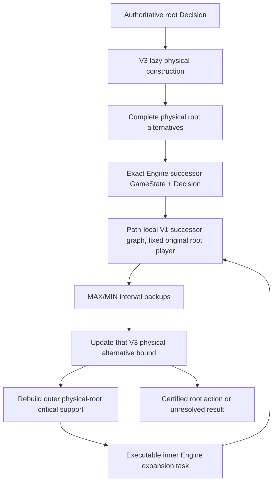

# MADS-04 – End-to-End Dynamic Decision Search

## Integration decision

The implementation extends the existing dynamic path search and virtual
physical root. It does not create a second minimax implementation.

- `DynamicEngineSearchV3` remains responsible for the admitted Lightning
  Bolt/Pass physical response domain, authoritative response execution, and
  successor `GameState`/`Decision` capture.
- Every completed physical root response gets its own path-local
  `DynamicEngineSearchV1`, initialized from that exact captured successor but
  with the original physical root actor fixed as the MAX perspective. The
  successor actor therefore becomes MAX or MIN by comparison to the original
  root player.
- V1's existing `backup_bounds_v1`, authoritative `engine::step` expansion,
  cycle rejection, and bound propagation are reused. No state is merged
  between physical alternatives; there is no live key or TT.
- A second, additive V1 successor-value frontier follows both lower- and
  upper-bound support for either a MAX or MIN successor root. The existing
  public V1 frontier/result contract is unchanged.
- The V4 outer frontier rebuilds the physical-root incumbent/challenger
  support from V3 bound cells, then maps each supported complete action to
  its current executable V1 node/action task. The V1 successor frontier
  selects the exact Engine action inside that path-local successor search.
- If V1 cannot admit a successor decision or an action's continuation, its
  slot stays unresolved. V4 removes the blocked task from scheduling without
  narrowing that physical action's interval.



## Versioned interfaces and policies

Public entry point:

```rust
DynamicEngineSearchV4::new(root_state, root_decision)
search.run_v4(compute_budget)
```

The result keeps these claims separate:

```text
PHYSICAL_ACTION_COMPLETE
SUCCESSOR_SEARCH_EXECUTED
ROOT_ACTION_CERTIFIED
EXACT_ROOT_VALUE
UNRESOLVED_WITHIN_BUDGET
BLOCKED_ON_UNSUPPORTED_SUCCESSOR
```

Scheduler identities are distinct:

```text
physical completion: FRONTIER_PHYSICAL_ROOT_ENUMERATION_V3_CAST_THEN_PASS_THEN_TARGET_ORDER
outer root policy:   FRONTIER_ROOT_CRITICAL_PHYSICAL_V4_REBUILD
inner value policy:  FRONTIER_REBUILD_SUCCESSOR_VALUE_V1
```

The physical construction order remains the bounded V3 protocol. After that
domain is admitted, V4 actually selects work from complete physical root
support roles and executable successor Engine tasks. A logical budget unit
can perform more than one Engine transition when V3 replays a shared cast
prefix for an independent physical response; transition and clone metrics are
reported separately.

## Engine and construction support

The real root admission scope remains the complete Lightning Bolt + Pass
domain from a quiescent `CastSpellOrPass` frame. The `ChooseTargets` candidates
and their order are taken from the actual PendingCast frame. For each target
answer, V3 replays the cast from an owned root clone, checks the exact post-cast
state/frame and candidate list, applies the target, confirms cast
finalization/stack target, and retains the resulting successor state and
decision.

For a successor priority frame that V3 itself cannot completely project, V3
retains the revalidated actual state and raw decision without claiming V3
candidate-domain admission. V4 then independently asks the existing V1 Engine
adapter to validate and enumerate that complete successor decision. A V1
admission or transition failure stays unresolved.

The admitted V1 successor node kinds are:

- `CastSpellOrPass` with the full action domain produced by the existing
  `complete_cast_domain` contract;
- `DeclareAttackers` only when the Engine frame has no eligible attackers;
- authoritative `GameOver` terminal decisions.

V1 does not admit staged spell Construction such as `ChooseTargets`,
`ChooseCastMode`, or `ChooseCostTargets`; it does not admit nonempty attacker
decisions, trigger ordering, arbitrary effect prompts, or other unsupported
frames. A `CastSpell` that leads to such a continuation remains an unexpanded
slot with a conservative envelope. `Halted` is not a terminal value.

The privileged V4 lane uses full Engine state for authoritative decisions.
It does not export hidden state to player observations or teacher labels.

## Bounds and certification

All terminal values originate in authoritative `Decision::GameOver` frames
and are converted to root-player utility. Intermediate nodes reuse the shared
MADS bound backup:

```text
LOSS = -1, DRAW = 0, WIN = +1, UNKNOWN = [-1,+1]

MAX partial node: L=max(expanded child L), U=+1 while any legal action is open
MIN partial node: L=-1 while any legal action is open, U=min(expanded child U)
```

V1 updates its path-local successor graph after each accepted Engine
transition. V4 then copies that valid root interval to the owning complete
physical action with `VirtualPhysicalRootV3::update_successor_bounds` and
rebuilds the V3 root-critical frontier. It never copies a heuristic into a
certified bound. V3 compares each candidate lower bound with every competing
physical alternative upper bound. Root certificates can therefore be issued
while another action remains UNKNOWN only when the candidate lower bound
dominates that UNKNOWN upper bound.

The dynamic graph is path-local and acyclic within the executed decision path.
V1 rejects a repeated ancestor state/decision or its depth cap as unresolved;
there is no repetition-to-draw substitution and no cross-root state merging.

## Oracle validation and scheduler ablation

The new `mads_v1::tests::mads04_fifo_and_root_critical_match_oracle_on_nested_physical_actions`
uses two equivalent `OracleSuiteV1` fixtures:

- nested `Cast Bolt → DecisionConstruction(Target P0/P1)`;
- flattened complete physical roots `Bolt→P0`, `Bolt→P1`, `Pass`, `Other`.

The continuations include a P1 MIN node with both WIN and LOSS outcomes and a
P0 MAX node with both LOSS and WIN outcomes. Pass/Other tie at DRAW. The
fixture Oracle confirms both views have root WIN and only `Bolt→Target(P1)` is
optimal. After every expansion, both schedulers' node, action, and root
intervals are checked to contain their exact Oracle values. Both fully
expanded graphs return the same exact root value and certified action.

Measured expansion ablation on this one synthetic fixture:

| Comparator | Expansions to first certificate | Total expansions | Frontier rebuilds |
|---|---:|---:|---:|
| FIFO by node admission/action order | 8 | 8 | 0 |
| Root-critical reference frontier | 6 | 8 | 10 |

This is a two-expansion reduction to first certificate on this synthetic
fixture only. Total expansions are equal. It is not a Magic performance or
wall-time claim; the extra reference-frontier rebuilds are measured and
reported. The fixture also verifies a nested Construction view against the
flattened physical-action oracle, but does not assert V1/V2/V3 scheduler
selection-order parity.

A second controlled-compute test uses the same Oracle graph for both policies,
with 64 complete root actions and 32 responses under each of 61 Draw
distractors. Graph/oracle construction is excluded equally from both timed
windows; each scheduler receives a 5 ms wall-clock search cap. The bounded
FIFO run used 20 expansions and reached no certificate before the cap (5.072
ms measured, including one expansion crossing the deadline); root-critical
used 6 expansions and certified the Oracle-optimal Bolt target (2.067 ms
measured). Every observed root interval continued to
contain the exact Oracle root value. This is one Debug-run wall-budget result,
not a CPU-normalized benchmark or general speedup claim; CPU time was not
measured.

## Real Engine results

The public V2, V3, and V4 adapters are compared on the same authoritative
Lightning Bolt + Pass root. Their full typed physical response sets match
exactly:

```text
CastSpell(Bolt) → ChooseTarget(P0)
CastSpell(Bolt) → ChooseTarget(P1)
Pass
```

The terminal fixture sets both players to 3 life and gives P0 one red mana and
Lightning Bolt. It uses only the real Engine pass/priority/resolution path.
The P0-target branch reaches an authoritative P1 win (`[-1,-1]` from P0's
perspective); the P1-target branch reaches an authoritative P0 win (`[+1,+1]`).
Pass remains UNKNOWN when the winning Bolt target has already certified the
root, and its upper bound is retained in the root competition.
Resuming the same completed V4 search after certification leaves the expansion
count at 8 and the transition count at 10; completed responses are not replayed.

Observed in the Debug test process on seed `0x04000001`:

| Metric | Result |
|---|---:|
| Logical expansions to first root certificate | 8 |
| Physical construction units | 4 |
| Successor Engine expansion attempts | 4 |
| Authoritative Engine transitions | 10 |
| State clones | 20 |
| Complete physical root actions | 3 |
| Successor GameDecision nodes admitted | 2 |
| Successor Terminal nodes admitted | 2 |
| Successor Construction nodes admitted | 0 |
| V3 successor domains directly admitted | 3 |
| Successor domains independently revalidated by V1 | 3 |
| MAX / MIN decision nodes admitted in the successor trees | 2 / 3 |
| Root bounds | `[+1,+1]` |
| Certified optimal physical root actions | 1 (`Bolt→Target(P1)`) |
| UNKNOWN root alternatives | 1 of 3 (`Pass`) |
| V4 initialization wall time | 0.279 ms |
| Successor-search initialization wall time | 0.162 ms |
| Search wall time | 2.950 ms, across V4 run calls including successor setup |
| CPU time / peak RSS | Not measured |

On the same seed/position, V2 physical enumeration measured 4 Engine
transitions/5 state clones, V3 measured 6/13, and V4 measured 10/20. V4 adds
four successor passes and their GameOver transitions to the V3 physical
construction cost, along with inner-search and outer-frontier work. The V2,
V3, and V4 full typed action domains match. These are Debug-fixture costs, not
a speed comparison between the different search outcomes.

A negative real Engine fixture gives P1 Fireblast plus Mountains while the
P0 root remains exactly Bolt + Pass. V3 retains the unsupported P1 successor
frame without claiming its candidate domain; V1 independently revalidates
that priority domain, then refuses the Fireblast Construction continuation.
V4 reports `BLOCKED_ON_UNSUPPORTED_SUCCESSOR`, leaves affected root intervals
UNKNOWN, and issues no certificate. No Fireblast mode/payment values are
invented.

## Metrics and limits

V4 reports authoritative transitions, state clones, admitted/expanded
actions, bound updates, graph/frontier rebuilds, complete physical actions,
successor GameDecision nodes, domain revalidation, UNKNOWN/unresolved root
counts, expansions to first certificate, initialization wall time, search
wall time, and certification status. CPU time and peak process RSS remain
`None` because the focused portable test harness does not measure them.

The real V4 search is still limited by DynamicEngineSearchV1's admitted
decision set. Unsupported target/payment/effect/trigger/attack constructions
remain UNKNOWN and can block an alternative. There is no exact live state key,
TT, POR, hidden-information model, general Pauper coverage, or fair bot
evaluation. The benchmark Checkpoints and lanes in the MADS-03A inventory are
not made runnable by this increment. No policy/value heuristic is used as a
bound.

## Verification

Focused checks for this increment and its dependencies:

| Command | Result |
|---|---|
| `cargo test --locked -p mtg-kernel --lib mads04 -j 3` | PASS: 4 focused MADS-04 Engine/Oracle tests |
| `cargo test --locked -p mtg-kernel --lib mads03b5 -j 3` | PASS: 3 tests |
| `cargo test --locked -p mtg-kernel --lib mads_virtual_physical_root_v3 -j 3` | PASS: 7 tests |
| `cargo test --locked -p mtg-kernel --lib mads02e_structured_decision_audit_v1 -j 3` | PASS: 12 tests |
| `cargo test --locked -p mtg-kernel --lib mads02b_engine_probe_v1 -j 3` | PASS: 9 tests |
| `cargo test --locked -p mtg-kernel --lib mads_v1 -j 3` | PASS: 20 tests, including FIFO/root-critical Oracle ablation |
| `cargo check --locked -p mtg-kernel --lib -j 3` | PASS |
| `cargo fmt --all -- --check` | PASS |
| `cargo clippy --locked -p mtg-kernel --lib --tests -j 3 -- -D warnings -A clippy::type_complexity` | PASS; allow-lists only the known pre-existing Dynamic Search test-helper lint |

Cargo commands use the shared Windows mutex `Global\\mtg-kernel-cargo-build.lock`,
`--locked -j 3`, and the existing `C:\\Dev\\mtg-kernel-target` cache. No full
workspace test, release/Thin-LTO, CUDA, `verify_all.sh`, training, or broad
benchmark was run.

## Open proof obligations

1. General candidate-domain/completion support remains limited to the V3
   Lightning Bolt + Pass physical root and V1's documented successor kinds.
2. An unsupported successor keeps its physical action conservative but blocks
   that path; broader effect, mode, payment, combat, trigger, and activation
   protocols need separate complete domains and physical completion proofs.
3. V4 creates an independent V1 tree per physical root action. This avoids
   unsafe cross-path merges but duplicates work; no exact TT or DAG
   transposition reuse is claimed.
4. Live DecisionStateKey authentication/equivalence remains unproven and the
   productive TT gate remains closed. V3/V4 path-local IDs are not reusable
   state keys.
5. This privileged perfect-information Engine lane is not a fair
   player-facing bot/teacher lane. Hidden-information fairness, general
   Pauper-game certification, and trained-checkpoint availability remain
   open.
6. The Oracle ablation shows fewer expansions to certificate on one fixture,
   while total expansions tie. It does not establish real-game speedup, win
   rate, or benchmark-hardware performance. Release qualification remains a
   separate optimized-build gate.

```text
EXECUTABLE_SUCCESSOR_GRAPH = IMPLEMENTED_ON_ADMITTED_SCOPE
PHYSICAL_ROOT_BOUND_MAPPING = TESTED
MAX_MIN_BACKUP = ORACLE_VALIDATED_AND_REAL_TERMINAL_TESTED
ROOT_CRITICAL_DYNAMIC_SCHEDULER = IMPLEMENTED_AND_TESTED_ON_FIXTURES
REAL_ENGINE_SUCCESSOR_EXPANSION = TESTED_ON_BOLT_PASS_SCOPE
REAL_ENGINE_TERMINAL_VALUE_PROPAGATION = TESTED_ON_TERMINAL_FIXTURE
TRUSTED_LIVE_KEY = NOT_PROVEN
PRODUCTIVE_EXACT_TT = DISABLED
```
